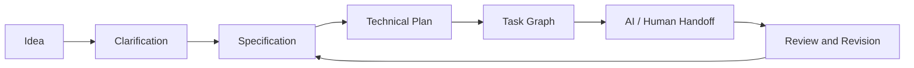

<div align="center">

# SpecFlow Studio

**A visual workspace for specification-driven software development.**

Turn an idea into an inspectable specification, implementation plan, task graph, and AI-coding handoff—without forcing every contributor to work from the command line.

[](ROADMAP.md)
[](#planned-architecture)
[](ABOUT.md)
[](https://github.com/xinjian0101/specflow-studio/issues)
[](https://github.com/xinjian0101/specflow-studio/commits)

</div>

> [!IMPORTANT]
> This repository is in the **foundation phase**. The product scope, interaction model, architecture, and contribution boundaries are being established before the first executable preview. No production-ready binary is claimed yet.

## About

SpecFlow Studio is planned as an independent desktop companion for structured, specification-driven development workflows. It will help users capture product intent, resolve ambiguous requirements, generate implementation plans, split work into verifiable tasks, and export the result to AI coding tools and human development teams.

The project is not intended to hide engineering decisions behind a single “generate” button. Every generated artifact should remain readable, editable, versionable, and suitable for review in Git.

## Product principles

| Principle | Meaning |
|---|---|
| Visual first | Core planning operations should be accessible without memorizing CLI commands. |
| Inspectable | Specifications, plans, tasks, and exports remain plain-text and reviewable. |
| Tool neutral | The workspace should support multiple coding assistants rather than lock users to one vendor. |
| Local first | Project files and drafts should remain on the user’s machine by default. |
| Version aware | Meaningful requirement and plan changes should be comparable over time. |
| Honest automation | Generated content must be marked as generated and remain subject to human approval. |

## Planned workflow



## Planned capabilities

- Guided project creation with reusable project profiles.
- Structured specification editor with ambiguity and completeness checks.
- Technical-plan editor covering architecture, interfaces, data, security, and testing.
- Task graph with dependencies, ownership, status, and acceptance criteria.
- Side-by-side version comparison for requirements and plans.
- Export adapters for Codex, Claude Code, Cursor, OpenCode, Gemini CLI, and generic Markdown workflows.
- Local workspace storage with portable project folders.
- Template packs for desktop, web, API, data, automation, and AI-agent projects.
- Validation reports that explain missing sections rather than silently rewriting them.

## Interface direction

| Area | Purpose |
|---|---|
| Project rail | Switch projects, templates, and recent workspaces. |
| Workflow canvas | Navigate Idea → Specification → Plan → Tasks → Handoff. |
| Structured editor | Edit prose and machine-readable fields together. |
| Review panel | Surface ambiguity, missing acceptance criteria, and unresolved decisions. |
| Export center | Preview exact files before writing them to a repository. |

## Planned architecture

```text
Tauri desktop shell
├── React + TypeScript interface
├── local project workspace
├── schema and validation layer
├── adapter system
│   ├── generic Markdown
│   ├── Codex
│   ├── Claude Code
│   ├── Cursor
│   └── OpenCode / Gemini CLI
└── SQLite metadata index
```

The architecture remains provisional until an architecture decision record is accepted.

## Project status

| Workstream | State |
|---|---|
| Product definition | Active |
| Information architecture | Active |
| Desktop shell | Planned |
| Specification schema | Planned |
| Export adapters | Planned |
| Packaging and releases | Planned |

See [ROADMAP.md](ROADMAP.md) for release gates and [ABOUT.md](ABOUT.md) for positioning, scope, and repository metadata.

## Contributing

Early contributions should focus on requirement review, workflow design, accessibility, schema design, and small prototypes. Large implementation pull requests should wait until the initial architecture decision records are published.

Use Issues for focused proposals. Each proposal should explain the user problem, expected behavior, non-goals, validation approach, and compatibility impact.

## Relationship to upstream tools

SpecFlow Studio is planned as an independent companion project inspired by specification-driven development workflows. It is not an official GitHub product and should not imply endorsement by GitHub or any AI-tool vendor.

## Maintenance

Repository changes are recorded through focused commits, roadmap updates, issue discussions, and release notes. Documentation must be updated when scope or behavior changes.

## License

The final project license and third-party notices will be selected before source code derived from or integrated with upstream projects is published.